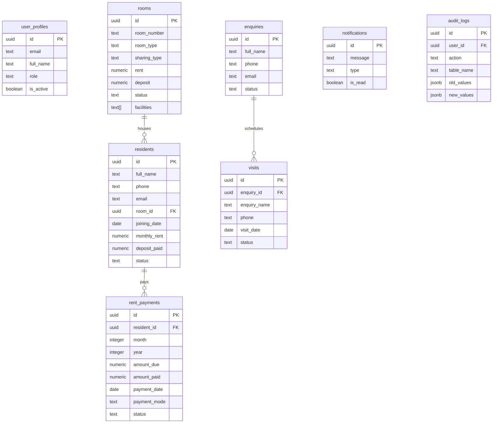

# 🏢 Sri Vinayaka PG Management System

A premium, modern Paying Guest (PG) and Hostel Management web application built with **React 19**, **Vite**, **Tailwind CSS v4**, **TypeScript**, and **Supabase**.

This repository contains both a stunning, responsive customer-facing website and a powerful admin portal designed to handle the daily operations of PG accommodation facilities.

---

## 🎨 System Highlights & Features

### 🌐 Public Portal (Customer Facing)
- **Responsive Landing Page**: Sleek design featuring dynamic hero components, facilities highlights, and curated gallery views.
- **Room Showcases**: View room details, sharing types (Single, Double, Triple, Premium), availability, and rent packages.
- **Interactive Enquiries**: Instant enquiry form submission for prospective residents.
- **Visit Scheduling**: Schedule physical/virtual visits on specific dates and times.
- **Location Map Integration**: Seamless view of local amenities and Google Maps locations.

### 🛡️ Admin Dashboard (Management Portal)
- **Executive Analytics Overview**: Visual summaries of occupancy rates, revenue metrics, active residents, pending tasks, and recent enquiries using interactive charts.
- **Rooms Management**: Keep track of room statuses (`available`, `occupied`, `maintenance`), room configurations, and facilities.
- **Residents Management**: Complete lifecycle tracking of check-ins, check-outs, status updates (`active`, `notice_period`, `left`), ID verification docs, and emergency contacts.
- **Rent Tracking Ledger**: Streamlined management of due/paid rent, UPI/cash transactions, monthly ledgers, and overdue billing alerts.
- **Enquiry & Visit Pipeline**: Update status updates (`new`, `contacted`, `converted`) and manage scheduled visits.
- **Facilities & Gallery Editors**: Real-time management of public-facing amenities and media gallery items directly from the panel.
- **Security Audit Logs**: Track core events (`INSERT`, `UPDATE`, `DELETE`) with user-associated action logs.
- **System Settings**: Configurable key-value store for contact information, PG metadata, and public details.

---

## 🛠️ Tech Stack

- **Frontend Core**: [React 19](https://react.dev/), [TypeScript](https://www.typescriptlang.org/), [Vite](https://vite.dev/)
- **Styling**: [Tailwind CSS v4](https://tailwindcss.com/) (using native Vite plugin `@tailwindcss/vite`)
- **Routing**: [React Router DOM v7](https://reactrouter.com/)
- **Charts & Visualization**: [Recharts](https://recharts.org/)
- **Animations**: [Framer Motion](https://www.framer.com/motion/)
- **Backend Database & Auth**: [Supabase](https://supabase.com/) (PostgreSQL with RLS, Triggers, and Functions)
- **Validation & Tooling**: [Zod](https://zod.dev/), [Lucide React](https://lucide.dev/), [React Hot Toast](https://react-hot-toast.com/), [Oxlint](https://oxc.rs/)

---

## 💾 Database Architecture

The database schema is structured in PostgreSQL on Supabase, featuring Row Level Security (RLS) and Audit Logging:



### Setup Scripts Included
- [`database_schema.sql`](file:///c:/Users/hp/Desktop/Projects/pg/database_schema.sql): Sets up tables, constraints, indexes, and schemas.
- [`triggers.sql`](file:///c:/Users/hp/Desktop/Projects/pg/triggers.sql): Automated triggers for updating timestamps, processing audit logs, and syncing tables.
- [`rls_policies.sql`](file:///c:/Users/hp/Desktop/Projects/pg/rls_policies.sql): Granular row-level security definitions for receptionists, managers, and super-admins.
- [`seed_data.sql`](file:///c:/Users/hp/Desktop/Projects/pg/seed_data.sql): Demo rooms, residents, and site configurations to populate your local database.

---

## 📁 Directory Structure

```text
├── .env.example              # Template for Supabase variables
├── database_schema.sql       # Core DB tables setup
├── triggers.sql              # Database triggers and hooks
├── rls_policies.sql          # RLS policies
├── seed_data.sql             # SQL mock seed data
├── index.html                # Vite index entry
├── vite.config.ts            # Vite build configuration with chunk splitting
└── src/
    ├── main.tsx              # Application mount point
    ├── App.tsx               # Main routing & layout controller
    ├── App.css               # Global application layout styles
    ├── index.css             # Tailwind setup and scrollbar utilities
    ├── api/                  # API clients and Supabase queries
    ├── components/           # Reusable UI & Layout components
    ├── constants/            # Configs & application routes
    ├── contexts/             # Global contexts (AuthContext)
    ├── hooks/                # Custom React Hooks
    ├── layouts/              # Multi-page layouts (Admin vs Public)
    ├── pages/                # Pages (split into admin/ and public/)
    ├── router/               # Route guard components
    ├── types/                # TypeScript interface declarations
    └── utils/                # Date formatting, numbers, and utility functions
```

---

## 🚀 Getting Started

### 1. Prerequisites
Ensure you have [Node.js](https://nodejs.org/) (v18+) and [npm](https://www.npmjs.com/) installed.

### 2. Installation
Clone the repository, navigate into the directory, and install dependencies:
```bash
npm install
```

### 3. Environment Setup
Copy the example environment file to `.env.local`:
```bash
cp .env.example .env.local
```
Edit the values in `.env.local` to link to your Supabase instance:

### 4. Database Setup
1. Create a project in [Supabase Console](https://database.new).
2. Go to the **SQL Editor** tab.
3. Run the files in the following order:
   - Run the contents of `database_schema.sql` (to create tables).
   - Run the contents of `triggers.sql` (to create triggers and functions).
   - Run the contents of `rls_policies.sql` (to set up security boundaries).
   - *(Optional)* Run `seed_data.sql` to populate rooms, facilities, and records.

### 5. Running Locally
Run the development server:
```bash
npm run dev
```
Open `http://localhost:5173` in your browser.

### 6. Build for Production
To bundle and optimize the project for deployment:
```bash
npm run build
```
Verify the build output:
```bash
npm run preview
```
https://shri-vinayaka-pg.vercel.app/
---

## 🤝 Contribution Guidelines
Feel free to open issues or submit pull requests for additional features (e.g. SMS integrations, automated billing receipts generator, support request ticket management).

## 📄 License
This project is proprietary. All rights reserved.
